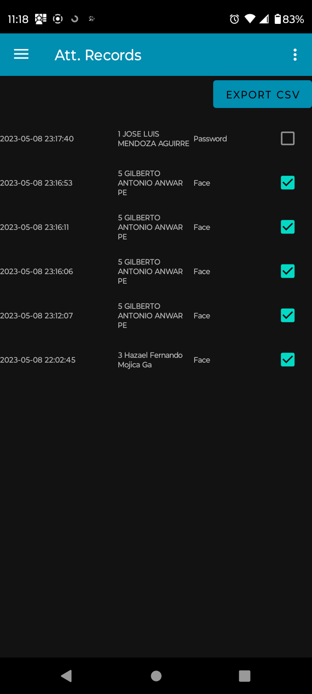
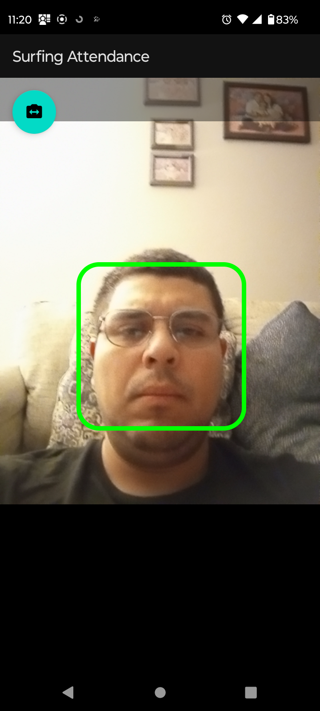

# SurfingAttendance

[](https://github.com/hmojicag/SurfingAttendance/blob/main/README.md)
[](https://github.com/hmojicag/SurfingAttendance/blob/main/README.es.md)

SurfingAttendance es una aplicación que funciona de una forma muy parecia a un reloj checador, este usa Tensor Flow Lite para el reconocimiento facial.
Puedes administrar/crear/editar usuarios.
Puedes agregar una BioPhoto (Rostro) a los usuarios, también un Password etc.
Puedes ver y exportar como CSV los registros de checadas.

Los usuarios podrán registrar su checada usando su cara o su password.

## Galería

<p align="center">
  &nbsp; &nbsp; &nbsp; &nbsp;
  &nbsp; &nbsp; &nbsp; &nbsp;
  &nbsp; &nbsp; &nbsp; &nbsp;
  
</p>

<p align="center">
  &nbsp; &nbsp; &nbsp; &nbsp;
  &nbsp; &nbsp; &nbsp; &nbsp;
  &nbsp; &nbsp; &nbsp; &nbsp;
  
</p>

<p align="center">
  &nbsp; &nbsp; &nbsp; &nbsp;
  &nbsp; &nbsp; &nbsp; &nbsp;
  
</p>

## Licencia

SurfingAttendance es una aplicación Open Source de Android, distribuída bajo una licencia Apache License, Version 2.0.

```
* Copyright 2023 Hazael Mojica and Soluciones de Software AJ. All Rights Reserved.
*
* Licensed under the Apache License, Version 2.0 (the "License");
* you may not use this file except in compliance with the License.
* You may obtain a copy of the License at
*
*       http://www.apache.org/licenses/LICENSE-2.0
*
* Unless required by applicable law or agreed to in writing, software
* distributed under the License is distributed on an "AS IS" BASIS,
* WITHOUT WARRANTIES OR CONDITIONS OF ANY KIND, either express or implied.
* See the License for the specific language governing permissions and
* limitations under the License.
```

## SurfingTime and ZKTeco devices

SurfingTime es un servidor en la nube usado para administrar múltiples dispositivos SurfingAttendance, por el momento esta es una característica premium de pago
que no está abierta al público pero si te sientes interesado en probarla puedes enviarme un email a mojica.hazael@gmail.com o a contacto@ssaj.com.mx.

Si SurfingTime está activado entonces los Usuarios, las BioPhotos y los registros de Asistencia serán sincronizados a SurfingTime.
Los usuarios y las biophotos creadas en un dispositivo se sincronizaran de forma automática a otros dispositivos.
Los registros de checadas de todos los dispositivos serán enviados a SurfingTime haciendo que puedan ser descargados y administrados desde un solo lugar.
Esto es realmente útil si se planea administrar más de un solo dispositivo SurfingAttendance.

SurfingTime también soporta el protocolo Push que los dispositivos de control de asistencia ZKTeco utilizan haciendo que SurfingAttendance se mezcle sin ningún problema con otro grupo de dispositivos ZKTeco.

Nuestro objetivo es abrir SurfingTime al público pero por el momento el soporte para SurfingTime sigue en desarrollo.

## Source disclaimer

SurfingAttendance está basado en el trabajo de `@estbanuri`:
* https://medium.com/@estebanuri/real-time-face-recognition-with-android-tensorflow-lite-14e9c6cc53a5
* https://github.com/estebanuri/face_recognition

Todo dentro de `app\src\main\java\mx\ssaj\surfingattendanceapp\detection` es casi uan copia idéntica de su trabajo.
El cuál viene siendo una wrapper sin terminar de un código de ejemplo de Tensor Flow Lite que por el momento no logro recordar de dónde lo saqué (todo el crédito a sus debidos autores).

Todo lo demás lo escribí yo.
