# SurfingAttendance

[](https://github.com/hmojicag/SurfingAttendance/blob/main/README.md)
[](https://github.com/hmojicag/SurfingAttendance/blob/main/README.es.md)

SurfingAttendance is an attendance management application that works much like a Punch Clock that uses face recognition provided by Tensor Flow Lite.
You can manage/create/edit Users.
Add a BioPhoto (Face) to Users, a Password etc.
See and export as CSV the Attendance Records (punches).

Users then will be able to "punch" by using their Face or by typing their Password.

## Galery

<p align="center">
  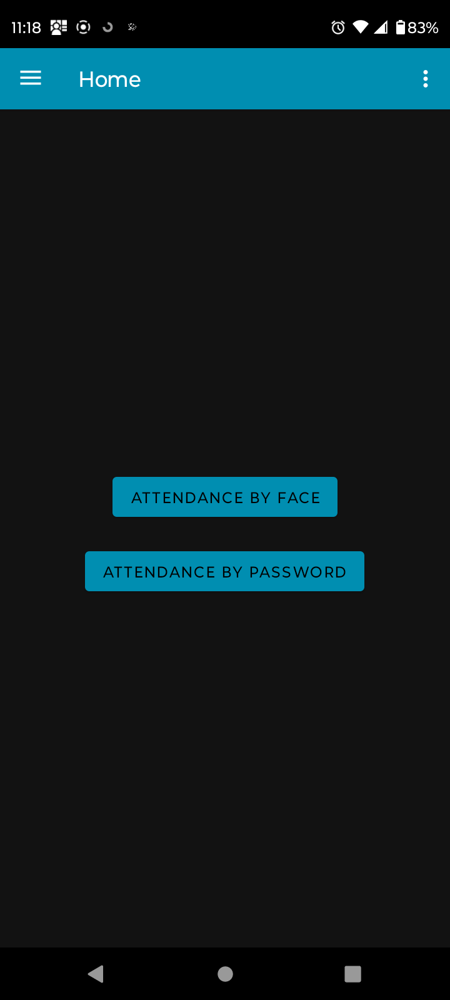&nbsp; &nbsp; &nbsp; &nbsp;
  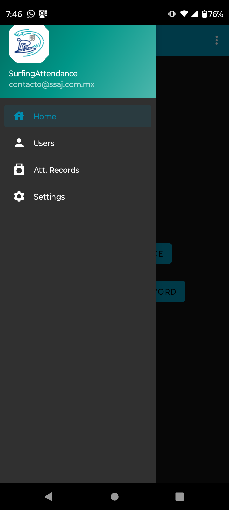&nbsp; &nbsp; &nbsp; &nbsp;
  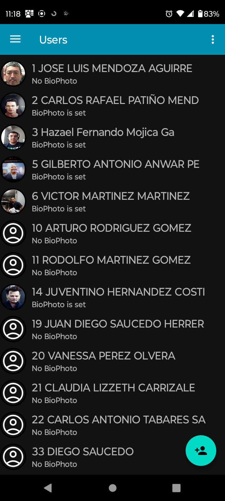&nbsp; &nbsp; &nbsp; &nbsp;
  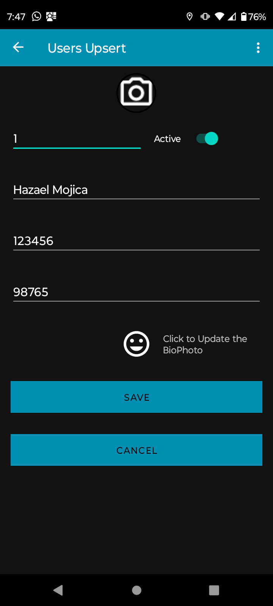
</p>

<p align="center">
  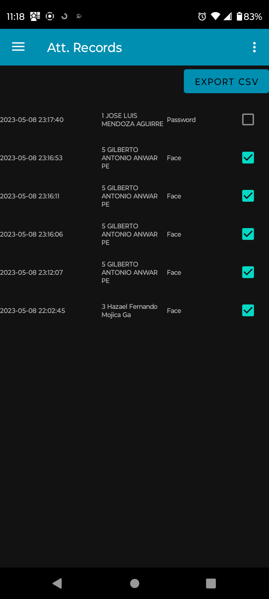&nbsp; &nbsp; &nbsp; &nbsp;
  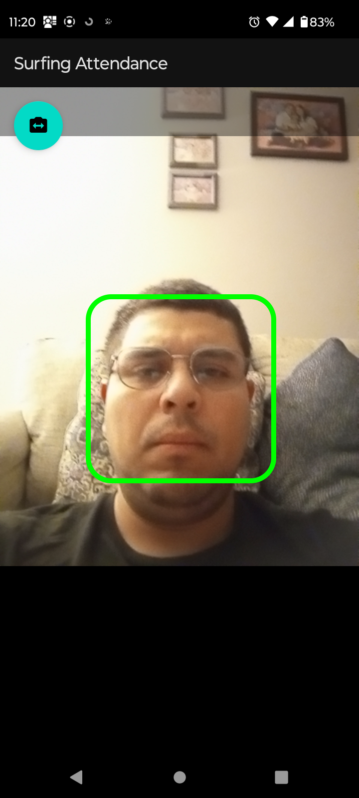&nbsp; &nbsp; &nbsp; &nbsp;
  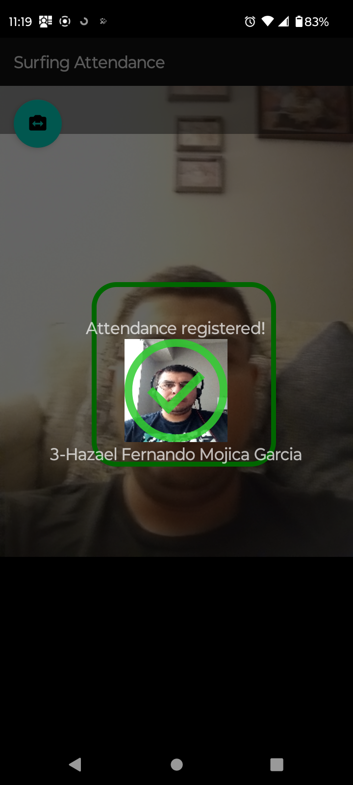&nbsp; &nbsp; &nbsp; &nbsp;
  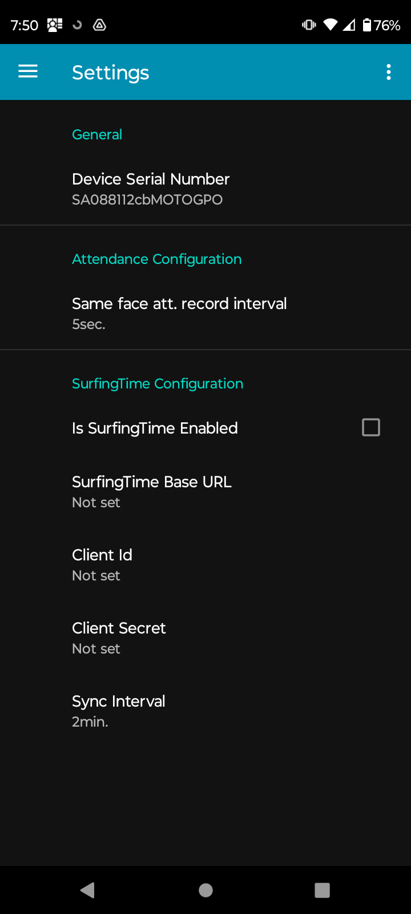
</p>

<p align="center">
  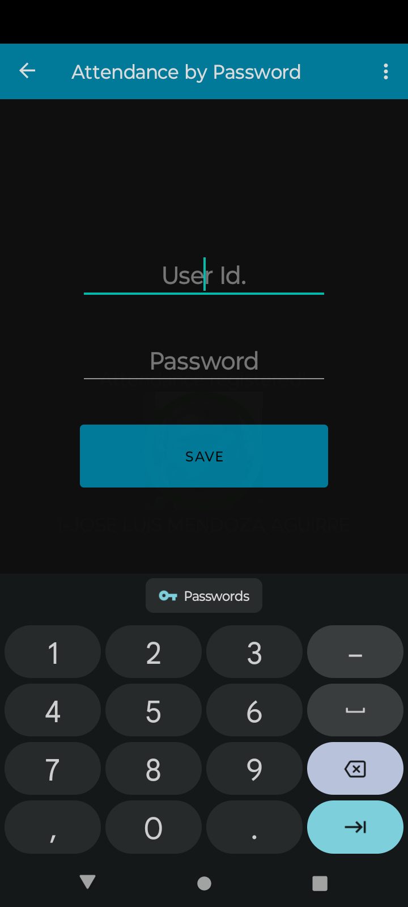&nbsp; &nbsp; &nbsp; &nbsp;
  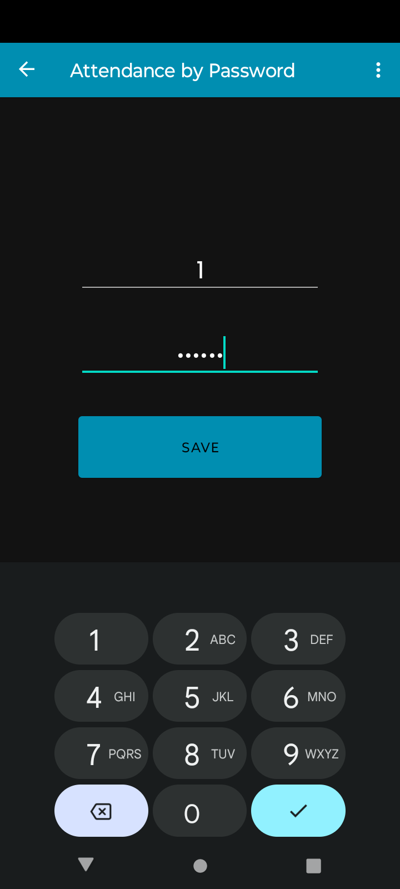&nbsp; &nbsp; &nbsp; &nbsp;
  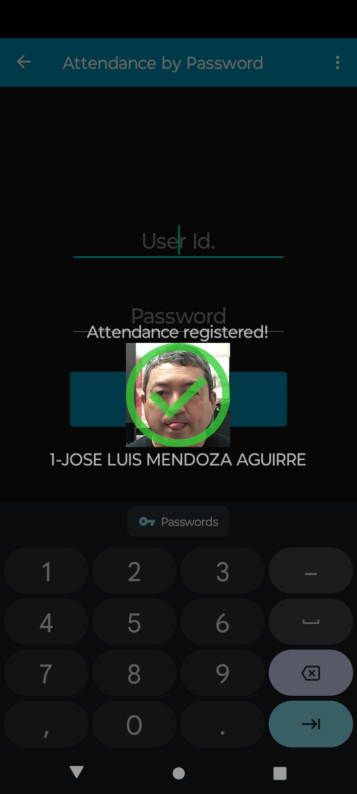
</p>

## License

SurfingAttendance is an Open Source Android Application distributed under Apache License, Version 2.0.

```
* Copyright 2023 Hazael Mojica and Soluciones de Software AJ. All Rights Reserved.
*
* Licensed under the Apache License, Version 2.0 (the "License");
* you may not use this file except in compliance with the License.
* You may obtain a copy of the License at
*
*       http://www.apache.org/licenses/LICENSE-2.0
*
* Unless required by applicable law or agreed to in writing, software
* distributed under the License is distributed on an "AS IS" BASIS,
* WITHOUT WARRANTIES OR CONDITIONS OF ANY KIND, either express or implied.
* See the License for the specific language governing permissions and
* limitations under the License.
```

## SurfingTime and ZKTeco devices

SurfingTime is a cloud server used to manage multiple SurfingAttendance devices, for now this is a Premium Paid Feature
that is not open to the public but if you feel like trying it shoot me an email at mojica.hazael@gmail.com or at contacto@ssaj.com.mx.

If the SurfingTime feature is enabled then Users, BioPhotos and Attendance Records will be synced to SurfingTime.
Users and BioPhotos create in one device will travel to others.
Attendance Records will be stored in SurfingTime making it easier to download and process them all in a single location.
This is extremely useful if you plan to manage more than 1 SurfingAttendance device.

SurfingTime also supports the Push protocol used by ZKTeco devices making a SurfingAttendance device merge seamlessly into a group ZKTeco devices.

We aim to open this feature to the public but at the time of writing this it's still under development.

## Source disclaimer

SurfingAttendance is based on the work of `@estbanuri`:
* https://medium.com/@estebanuri/real-time-face-recognition-with-android-tensorflow-lite-14e9c6cc53a5
* https://github.com/estebanuri/face_recognition

Everything inside `app\src\main\java\mx\ssaj\surfingattendanceapp\detection` is almost a copy and paste from his work.
Which in turn seems to be an unpolished but amazing wrapper around some Tensor Flow Lite sample code that I failed to recall the source at this time (All credit to their authors).

Everything else was coded by myself.

## Roadmap

* Clean up everything inside `app\src\main\java\mx\ssaj\surfingattendanceapp\detection` which is a real mess
* Probably create a separate re-usable library with a Component to use for Face Recognition alone
* Improve face detection capabilities
